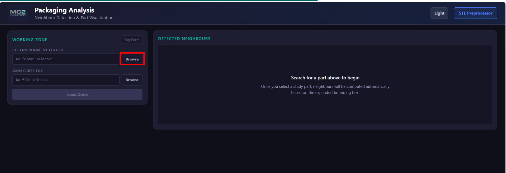
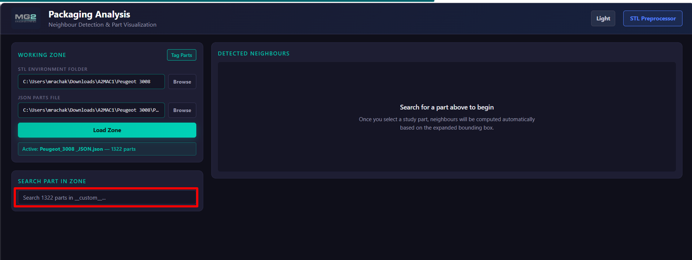
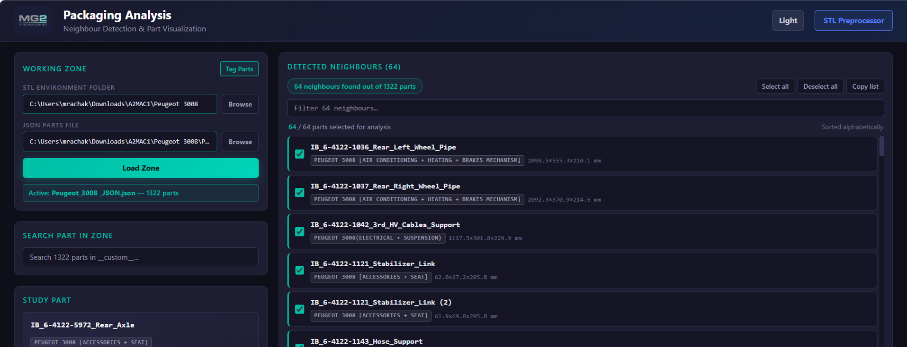
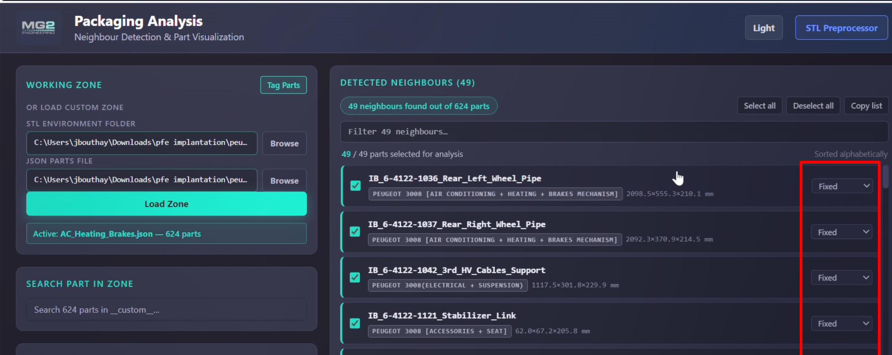
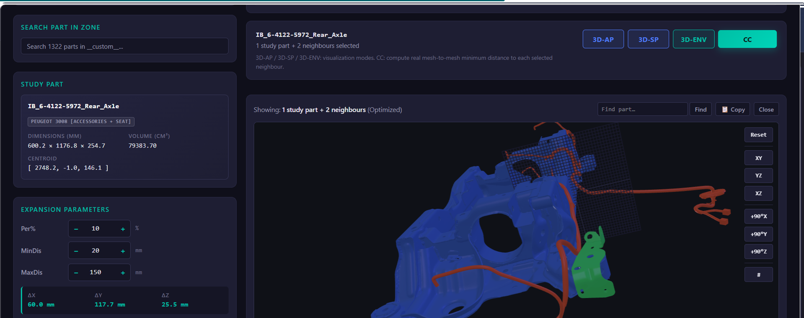
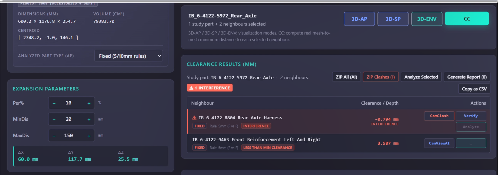
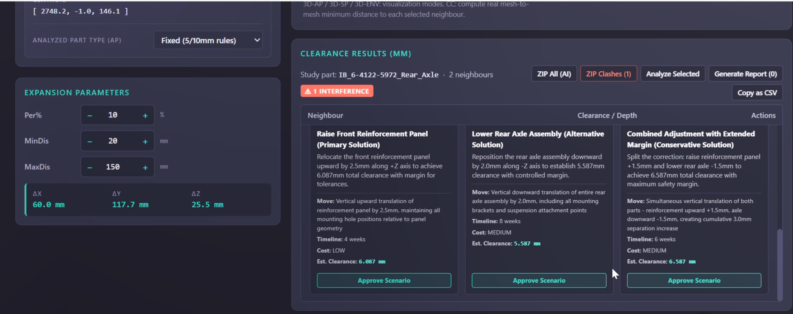
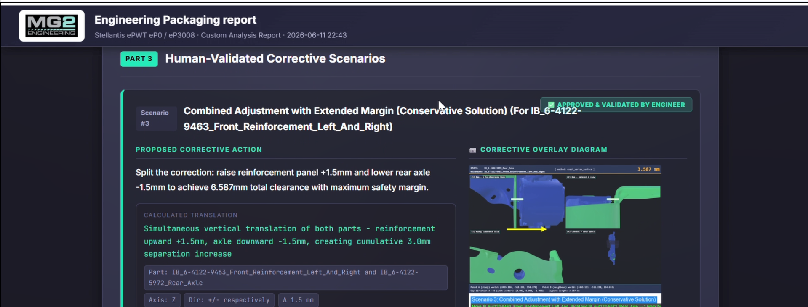
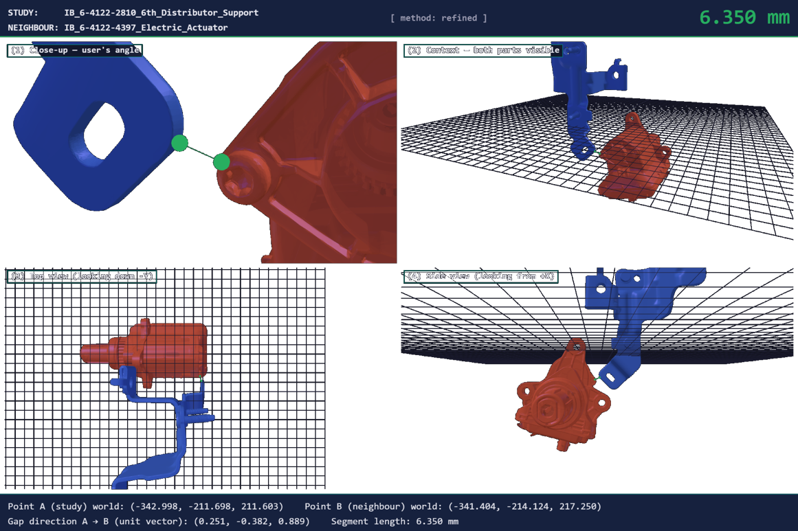

# Demo & Screenshots

A visual walkthrough of the application, following the end-to-end workflow from loading a zone to
generating an engineering report.

## 1. Load a zone

The app opens on the Working Zone panel. Browse for an STL environment folder and its JSON parts
file, then click **Load Zone**.

## 2. Zone loaded - search for a study part

Once a zone is loaded, its part count is shown and the full part list becomes searchable. Type in
**Search Part in Zone** to pick the part you want to study.

## 3. Automatic neighbour detection

Selecting a study part immediately computes its spatial **neighbours** using the expanded
bounding box. Each neighbour is listed with its size, and all are selected for analysis by default.

## 4. Tag each part's motion type

Every neighbour can be tagged **Fixed**, **Moving**, or **Connected**. The tag determines which
clearance rule applies (for example Fixed-Fixed = 5 mm, Moving-Moving = 15 mm).

## 5. 3D environment viewer

The **3D-ENV** view renders the study part (blue) together with its selected neighbours in an
interactive Three.js scene. The **Expansion Parameters** (Per % / MinDis / MaxDis) control how far
the neighbour search reaches, with the resulting per-axis expansion shown as delta X / Y / Z.

## 6. Clearance results

**CC** computes the real mesh-to-mesh minimum distance to each selected neighbour. Results are
listed with their verdict: interference (negative depth), below-minimum clearance, or acceptable.
Interfering rows can be re-verified at higher fidelity, and any row can be captured or analyzed.

## 7. AI corrective scenarios

Running the AI analysis returns a verdict plus concrete **corrective scenarios**. Each scenario
states which part to move, along which axis and by how many mm, with the resulting clearance,
estimated cost, and implementation timeline. An engineer approves the preferred option.

## 8. Generated engineering report

Approved scenarios are compiled into a shareable HTML **engineering report**: environment and part
verification, clearance verdicts, and the human-validated corrective scenarios - each with a
corrective overlay diagram.

## The image sent to the AI

For each analysis, the 3D viewer renders a single **multi-view composite** (2400x1600) and sends it
to the vision model. It packs four framed panels - a close-up at the user's angle, a context view
of both parts, a top view, and a side view - with a green CAD-style dimension line marking the
measured gap, plus a header (study/neighbour names, method, measured distance) and a footer (world
coordinates, gap direction, segment length). This gives the model unambiguous spatial evidence
instead of a single, easily-misread screenshot.

</content>
